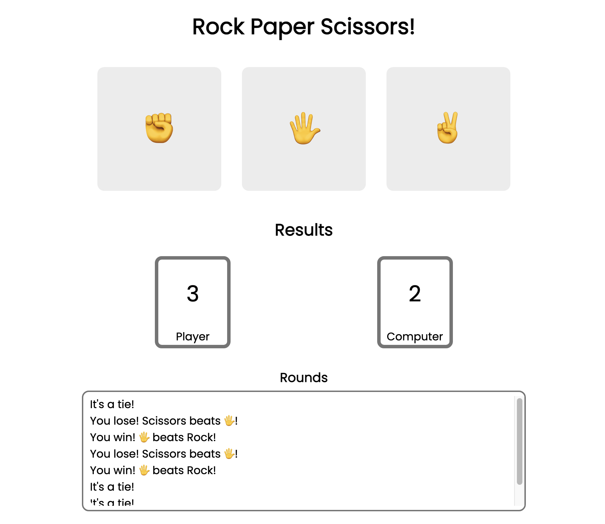

# The Odin Project - Rock Paper Scissors

Simple webpage of the game, rock paper scissors. Created as part of <a href="https://www.theodinproject.com/lessons/foundations-rock-paper-scissors">The Odin Project</a>. 

[🔗 Live Demo](https://ca-stella.github.io/odin-landing_page/)

### Outcomes
- Gained better understanding of JavaScript and functions
- Learned how to randomly select items out of an array
- Applied CSS transform/transition effects to enhance user experience 
- Aimed to improved code readability
  

### Technologies & Resources Used
 &emsp;  &emsp;  &emsp;   